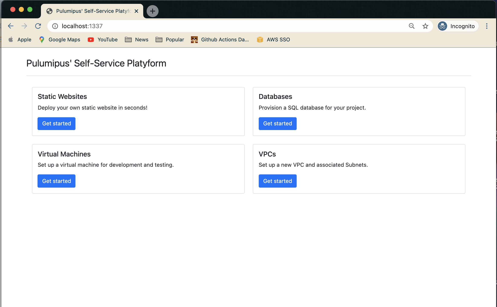

# Self Service Infrastructure Platyform

This application represents a starting point for how you might develop a self-service infrastructure platform on top of [Pulumi](https://pulumi.com)'s [Automation API](https://www.pulumi.com/blog/automation-api/).

In this case, we've used Python, [Flask](https://flask.palletsprojects.com/en/1.1.x/) and [Jinja](https://jinja.palletsprojects.com/en/2.11.x/) templates to create a web portal that allows users to deploy their own infrastructure.

One resource that we expose are static websites, which you can deploy either by passing in a URL to an HTML file or by manually typing out the content. We've exposed all of the CRUD operations, so you can `update` and `delete` your websites as well.

This idea is just a starting point for how you might build out your own infrastructure platform. The static website resource is fully developed, but databases, virtual machines and VPCs are not yet coded to completion. 

Alternatively, you could expose this functionality as a [REST API](https://github.com/pulumi/automation-api-examples/tree/main/python/pulumi_over_http), allowing deployments via CLI in addition to a web interface.

Pulumi's Automation API allows you to abstract away all of the "cloud stuff" that your users might not care to know, and bring them just the details they need, at the click of a button. The possibilities are endless!

**WARNING**: This is just a demo! I have not followed *any* security best-practices, so please don't deploy this thing to production.

## Instructions

To run this example you'll need a few pre-reqs:
1. A Pulumi CLI installation ([v2.10.1](https://www.pulumi.com/docs/get-started/install/versions/) or later)
2. The AWS CLI, with appropriate credentials.

First, set up your virtual environment:
1. ```shell
   $ python3 -m venv venv
   ```
2. ```shell
   $ venv/bin/python3 -m pip install --upgrade pip
   ```
3. ```shell
   $ venv/bin/pip install -r requirements.txt
   ```

In a terminal window, run the HTTP server that uses Automation API. It will also stream update logs:

```bash
$ FLASK_RUN_PORT=1337 FLASK_ENV=development FLASK_APP=app venv/bin/flask run
* Environment: development
 * Debug mode: on
 * Running on http://127.0.0.1:1337/ (Press CTRL+C to quit)
 * Restarting with stat
 * Debugger is active!
 * Debugger PIN: 328-006-235
```

Then, in your browser, navigate to `localhost:1337` and you should see a page matching the image below. Click around and start exploring!


